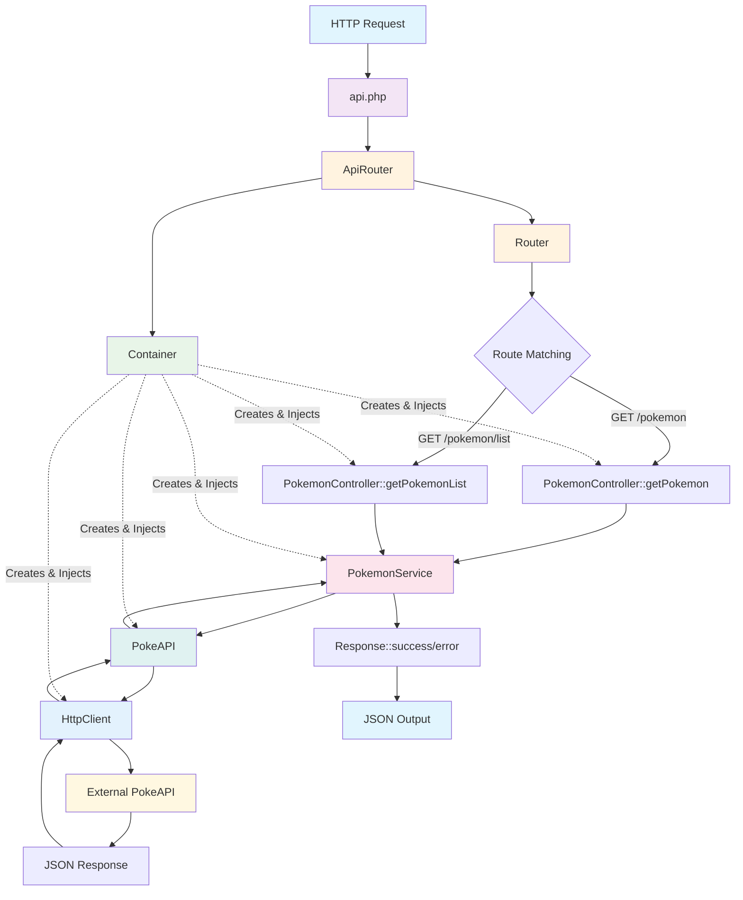

# Pokemon API - KDA Demonstration

### 1. Abstract Classes and interfaces

**Concept**: Providing a common interface while enforcing implementation of specific methods in child classes.

```php
// src/API/AbstractRequest.php
abstract class AbstractRequest implements RequestInterface, ValidatableInterface
{
    protected array $errors = [];

    public function __construct(
        protected string $method,
        protected string $uri,
        protected array $headers = [],
        protected array $body = []
    ) {}

    // Forced to implement by RequestInterface
    public function getMethod(): string { return $this->method; }
    public function getUri(): string { return $this->uri; }
    
    // Forced to implement by ValidatableInterface
    abstract public function validate(): bool;
}
```

### 2. Interface Segregation & Dependency Injection

**Concept**: Small, focused interfaces that promote loose coupling and testability.

```php
// src/API/Contracts/RequestInterface.php
interface RequestInterface
{
    public function getMethod(): string;
    public function getUri(): string;
    public function getHeaders(): array;
    public function getBody(): array;
    public function validate(): bool;
}
```

**Showcasing DI**:
```php
// src/API/Controllers/PokemonController.php
class PokemonController
{
    public function __construct(private PokemonService $pokemonService) {}
    
    public function getPokemon(): void
    {
        $name = $_GET['name'] ?? '';
        $data = $this->pokemonService->getPokemon($name);
        Response::success($data);
    }
}
```

### 3. Custom Exception Hierarchy

**Concept**: Specialized exception handling for different error scenarios.

```php
// src/API/Exceptions/ValidationException.php
class ValidationException extends ApiException
{
    private array $errors;

    public function __construct(array $errors = [], string $message = 'Validation failed', int $code = 400)
    {
        $this->errors = $errors;
        parent::__construct($message, $code);
    }

    public function getErrors(): array
    {
        return $this->errors;
    }
}
```

**Usage in Service Layer**:
```php
// src/API/Services/PokemonService.php
public function getPokemon(string $name): array
{
    if (empty(trim($name))) {
        throw new ValidationException(['name' => 'Pokemon name is required']);
    }
    return $this->pokeApi->getPokemon($name);
}
```

### 4. Dependency Injection Container

**Concept**: DI, Singleton

```php
// src/API/Internal/Container.php
class Container
{
    private array $instances = [];

    public function get(string $class): object
    {
        if (isset($this->instances[$class])) {
            return $this->instances[$class];
        }
        return $this->instances[$class] = $this->create($class);
    }

    private function create(string $class): object
    {
        return match ($class) {
            HttpClientInterface::class => new HttpClient(),
            PokeAPI::class => new PokeAPI($this->get(HttpClientInterface::class)),
            PokemonService::class => new PokemonService($this->get(PokeAPI::class)),
            PokemonController::class => new PokemonController($this->get(PokemonService::class)),
            default => throw new \InvalidArgumentException("Cannot resolve class: {$class}")
        };
    }
}
```

### 5. Layered Architecture Pattern

**Concept**: Separation of concerns

```
Controller Layer → Service Layer → External API Layer
     ↓               ↓               ↓
  HTTP Logic    Business Logic   Data Access
```

**Controller**
```php
public function getPokemonList(): void
{
    try {
        $limit = (int)($_GET['limit'] ?? 20);
        $offset = (int)($_GET['offset'] ?? 0);
        $data = $this->pokemonService->getPokemonList($limit, $offset);
        Response::success($data);
    } catch (ValidationException $e) {
        Response::badRequest($e->getMessage(), $e->getErrors());
    }
}
```

**Service**
```php
public function getPokemonList(int $limit = 20, int $offset = 0): array
{
    if ($limit < 1 || $limit > 100) {
        throw new ValidationException(['limit' => 'Limit must be between 1 and 100']);
    }
    
    if ($offset < 0) {
        throw new ValidationException(['offset' => 'Offset must be non-negative']);
    }
    
    return $this->pokeApi->getPokemonList($limit, $offset);
}
```

### 6. Inheritance

**Concept**: Extending abstract classes to provide specific functionality.

```php
// src/API/Http/Requests/GetRequest.php
class GetRequest extends AbstractRequest
{
    public function __construct(string $uri, array $headers = [])
    {
        parent::__construct('GET', $uri, $headers);
    }

    public function validate(): bool
    {
        $this->errors = [];

        if (empty($this->uri)) {
            $this->errors[] = 'URI is required';
        }

        if (!filter_var($this->uri, FILTER_VALIDATE_URL) && !str_starts_with($this->uri, '/')) {
            $this->errors[] = 'Invalid URI format';
        }

        return empty($this->errors);
    }
}
```

## System Architecture Flow


